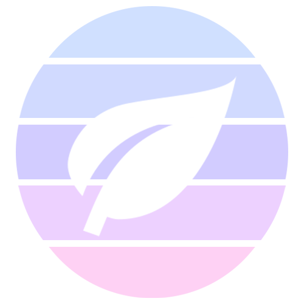

<p align="center">
  
</p>
<p align="center">
    <a href="https://jitpack.io/#com.skoumal/teanity"></a>
</p>

# UI Module

In this module we provide animation and UI utilities. Namely repetitive dimensions and attributes
are defined here.

## Attributes

Learn how to use attributes here:

- [Attributes](src/main/res/values/attributes.xml)
- Dimensions
  - [Elevation](src/main/res/values/elevation_dimens.xml)
  - [Layout](src/main/res/values/layout_dimens.xml)
  - [Radius](src/main/res/values/radius_dimens.xml)

## Spring animations

Spring animations don't have really nice API compared to view attribute animators, so we changed
that.

### Example

```kotlin
fun animateViewToPosition(view: View) {
    view.springify()
        .x(100)
        .y(0)
        .start()
}
```

## [CornerLayout](src/main/java/com/skoumal/teanity/ui/CornerLayout.kt)

Cards are really bulky and don't really fit the singular purpose of clipping the corners of child
views. CornerLayout helps you achieve just that. Clip corners, nothing more.

### Reference

Refer to [attributes](src/main/res/values/attributes.xml) for available view props